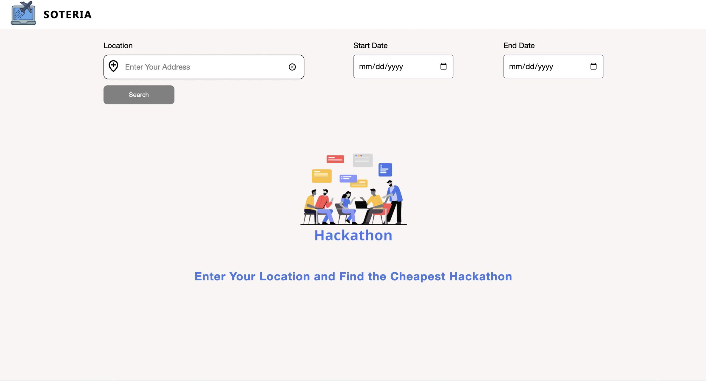

# Flyout

[](#) [](#) [](#)

Flight-optimized hackathon discovery platform. Enables global hackathon search based on flight costs and availability. Built with modern web technologies and comprehensive monitoring systems.



## System Design

Production-grade monitoring and deployment architecture. Next.js/React frontend with CSS Modules. Typography through Google Fonts. Full performance monitoring stack: k6, Prometheus, Grafana. Docker-based deployment with Compose orchestration.

Testing framework handles 20 VUs for average load, 100 VUs for stress testing. Performance thresholds: sub-1% error rate, sub-500ms p95 response times. Real-time metrics visualization with 5-second dashboard updates.

Core APIs:
- Search functionality
- Data aggregation
- Flight integration
- Hackathon data processing

## Core Problem

Standard hackathon selection process breaks down at scale. Manual flight comparison across multiple events becomes intractable. Price fluctuations require constant monitoring. Geographic constraints artificially limit participation. No existing solutions combine hackathon and flight data effectively.

## Technical Implementation

Architecture breakdown:
- Frontend: React/Next.js 
- Backend: Node.js
- Data Sources:
  - MLH Events API
  - Flight pricing APIs
  - Geolocation services

System Components:
1. Data aggregation layer
2. Price optimization engine
3. Search indexing system
4. Real-time flight monitoring

## Development Setup

Required steps:
```bash
npm i && npm run dev
mv next.config.sample.js next.config.js
```

Configuration requirements:
1. API key acquisition
2. next.config.js setup
3. Environment variable configuration
4. Database connection initialization

Performance optimizations:
- Flight data caching
- Request throttling
- API call optimization
- Rate limit management